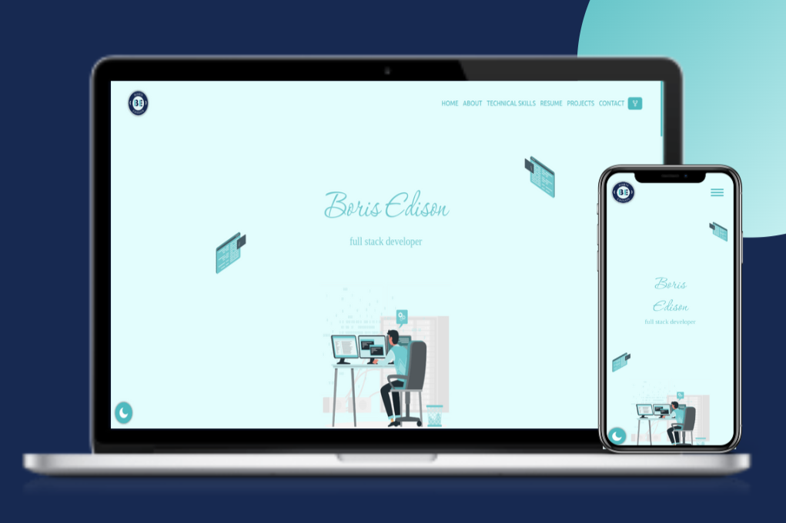

<h2 align="center">
  ササキ　アツシ<br/>
  <a href="" target="_blank">ササキ.in</a>
</h2>
<h4 align="center">Portfolio Website</h4>
<div align="center">
  
</div>

# Built With


# Features <a id="features"></a>

- Fully Responsive Portfolio Website
- Modern UI Design
- Single Page layout
- Includes dark mode
- Comes with Bootstrap grid system
- Easy colour changes can be done through simple variable edits

# Contribute  <a id="contribute"></a>
Contributions are welcome, and they are greatly appreciated! Every little bit helps, and credit will always be given.

Please star the repo and feel free to make pull requests

## Not sure where to start?  <a id="wheretostart"></a>

#### Step 1:

#### Step 2:
Make sure you have nodejs 18.0.0 or higher and npm 8.6.0 or higher installed. Install dependencies with:

```
npm install
```

#### Step 3:
Once it's done start up a local server with:

```
npm run dev
```

Runs the app in the development mode
Open http://localhost:8000 to view it in the browser. The page will reload if you make edits

#### Step 4:

To create a production build:

```
npm run prod
```

## Deployment  <a id="deployement"></a>

## Show your support

Give a ⭐ if you like this website!

<a href="" target="_blank"></a>

# Contributors <a id="contributors"></a>
  - Boris Edison<br> 
  []()

# License  <a id="license"></a>

Code released under the
[MIT]() license


Built by <a href="">@ササキ　アツシ</a> for his own portfolio. ****. You are allowed to use this webpage for both personal and commercial use, but **NOT** to claim it as your own design. **A credit to the original author, Boris Edison, is a must!**

I value keeping my site open source, but as you all know, _**plagiarism is bad**_. It's always disheartening whenever I find that someone has copied my site without giving me credit. I spent a non-trivial amount of effort building and designing this iteration of my website, and I am proud of it! All I ask of you all is to not claim this effort as your own.